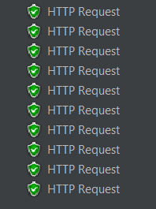
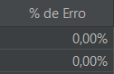
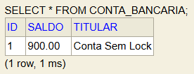
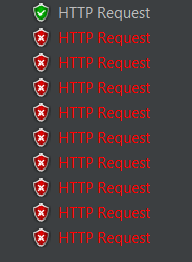
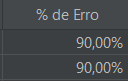
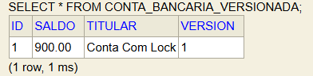

# Trabalho Prático: Concorrência e Consistência em Banco de Dados com Spring Boot

## Aluno
* **Nome:** Ruan William Leão dos Santos
* **Instituição:** Instituto Federal de Educação, Ciência e Tecnologia do Pará (IFPA) - Campus Belém
* **Curso:** Tecnologia em Análise e Desenvolvimento de Sistemas (TADS)
* **Contexto:** Atividade Prática de Sistemas Transacionais e Aplicações de Banco de Dados 

---

## Objetivo do Projeto
Compreender na prática os problemas decorrentes de acessos simultâneos a dados em sistemas transacionais (focado no problema clássico da **Lost Update / Atualização Perdida**) e validar o funcionamento do mecanismo de **Controle de Concorrência Otimista (@Version)** via JPA/Hibernate para assegurar a consistência dos dados.

---

## 🛠️ Tecnologias e Dependências Utilizadas
* **Java 17**
* **Spring Boot 3.x / 4.x**
* **Spring Data JPA** (Camada de persistência e ORM)
* **Spring Boot Starter Validation** (Validação das entradas de dados)
* **H2 Database** (Banco de dados relacional em memória)
* **Apache JMeter** (Simulador de carga e testes de concorrência)

---

## Instruções de Execução

### 1. Pré-requisitos
É necessário ter o **Java 17** (ou superior) instalado na máquina de execução.

### 2. Rodando a Aplicação
Abra o terminal de comandos diretamente na pasta raiz do projeto e execute o comando:

  ./mvnw spring-boot:run

-> Após rodar o comando:


1. A aplicação subirá na porta padrão 8080. Uma classe de configuração inicial (CargaInicial.java) criará de forma automática as contas de ID 1 (tanto para o modelo comum quanto para o versionado) com um aporte inicial de R$ 1000,00 cada.
2. Acesso ao Console do Banco de Dados (H2 Embedded)
* Para verificar a persistência e analisar os saldos em tempo real:
#### Endereço do Console: http://localhost:8080/h2-console 
#### JDBC URL: jdbc:h2:mem:bancodb
#### User Name: sa
#### Password: (mantenha o campo em branco)
3. O arquivo de configuração do plano de testes cenario-testes.jmx foi gerado no Apache JMeter e encontra-se devidamente salvo na raiz deste repositório. O cenário simula um ataque concorrente agressivo dividindo as requisições em dois grupos simultâneos:

Grupo 1 (Depósitos): 5 Threads simultâneas (POST /deposito)

Grupo 2 (Saques): 5 Threads simultâneas (POST /saque)

Ramp-up Period (Tempo de subida): 0 segundos (força o disparo absoluto de todas as 10 requisições no mesmíssimo milissegundo)

Loop Count: 1

Payload da Requisição (JSON): ```json
{ "valor": 100.00 }

### Relatório de Conclusão e Análise Comparativa
O teste simulou o envio simultâneo de **5 depósitos** de R$ 100,00 e **5 saques** de R$ 100,00 para uma conta cujo saldo inicial era de R$ 1000,00. Pela lógica aritmética pura (+500 e -500), **o saldo final correto e esperado em ambas as tabelas seria de exatamente R$ 1000,00.**

##### Quadro Comparativo de Métricas Coletadas
* Parte 1: Cenário Sem Bloqueio

Endpoint Alvo:	/contas/1/deposito
Taxa de Erro (JMeter):	0.00% (10 requisições com HTTP 200)
Saldo Final Obtido -  ex: R$ 900 ou 1100,00
Estado da Consistência: Corrompido (Inconsistente)
Coluna Version (H2)	Não Aplicável / Inexistente


* Parte 2: Controle Otimista (@Version)

Endpoint Alvo:	/contas/versionada/1/deposito
Taxa de Erro (JMeter):	90.00% (1 requisições com HTTP 200 e 9 com HTTP 409)
Saldo Final Obtido - ex: R$ 900 ou 1100,00 (Fixo na 1° operação)
Estado da Consistência: Preservada (Consistente)
Coluna Version (H2): Version = 1


 # Diagnóstico Crítico do Experimento
 **A Inconsistência do Cenário Concorrente Misto:**

* **Na Parte 1 (Sem Bloqueio) - O Erro Oculto:** O saldo terminou com um valor totalmente incorreto por conta da falha grave de **Lost Update (Atualização Perdida)**. Como o tempo de subida (*Ramp-up*) foi zero, as 10 threads (5 de saque e 5 de depósito) leram a linha do banco de dados no exato momento em que o saldo ainda constava como R$ 1000,00. Cada thread realizou a matemática em sua própria memória isolada e persistiu esse valor por cima do cálculo efetuado pela thread anterior. O sistema gerou uma falsa sensação de sucesso para o usuário externo (devolvendo HTTP 200 para todas), mas os saques e depósitos se atropelaram, resultando no saldo errado da conta.

* **Na Parte 2 (Com Controle Otimista) - A Proteção Ativa:** Sob o mecanismo de estrita segurança da anotação `@Version`, a primeira transação concorrente que completou o ciclo (seja ela um saque ou um depósito) atualizou o saldo corretamente e incrementou a versão de `0` para `1`. Quando as outras 9 transações restantes tentaram persistir seus resultados contendo a versão base antiga (`0`), o mecanismo do Hibernate detectou a divergência histórica e barrou as gravações de forma instantânea através da exceção `ObjectOptimisticLockingFailureException`. A aplicação tratou o erro, blindou o banco e respondeu adequadamente com **HTTP 409 Conflict**.

> **Conclusão:** O controle otimista provou ser um mecanismo eficiente para proteger a integridade financeira do sistema sem onerar o banco de dados com travas pesadas de infraestrutura (*Lock Pessimista*). Em sistemas corporativos reais, as 9 requisições barradas com o código HTTP 409 seriam identificadas pela camada de front-end ou por uma política automatizada de *Retry* (tentar novamente), reprocessando as requisições sequencialmente até que o saldo se estabilizasse nos R$ 1000,00 de maneira íntegra e sem perda de dados.
 
 Evidências de Testes (Prints dos Resultados)
 
 Evidências da Parte 1: Cenário Sem Bloqueio
 * Métrica do JMeter (Sem Lock): Todas as requisições mostrando uma falsa mensagem de sucesso -  / Porcentagem de erro -  
 * Auditoria de Saldo no H2 (Sem Lock): SELECT da Conta Bancária sem proteção com saldo "válido", segundo teste no JMeter - 
 
 Evidências da Parte 2: Cenário Com Lock Otimista
 * Métrica do JMeter (Com Lock Otimista): Apenas uma requisição válida, todas as outras não foram validadas -  / Porcentagem de erro - 
 * Auditoria de Saldo no H2 (Com Lock Otimista): SELECT da Conta Versionada mostrando requisição validada, apenas uma, demonstrado por "Version 1" 